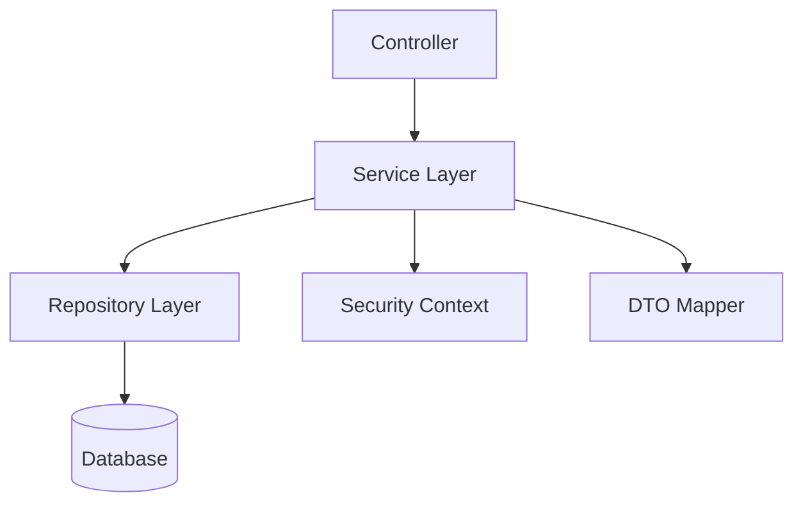

# 🧠 Task Manager Backend (Spring Boot)


## 📌 Overview
Robust REST API for task management with authentication and role-based authorization.

## 🚀 Features
- JWT Authentication
- Role-based Access Control
- Task CRUD (User + Admin)
- Exception Handling
- DTO Mapping

## 🏗️ Architecture



## 🔐 Security
- User can access only own tasks
- Admin can access all tasks

## 📂 Structure
```
controller/
service/
repository/
model/
dto/
mapper/
security/
```

## ⚙️ Setup
```bash
./mvnw spring-boot:run
```

## 🛠️ Dev Config
- Hibernate Auto Update
- SQL Logging Enabled

## 📡 API Endpoints
```
GET /api/tasks
POST /api/tasks
PUT /api/tasks/{id}
DELETE /api/tasks/{id}

ADMIN:
GET /api/admin/tasks
DELETE /api/admin/tasks/{id}
```
